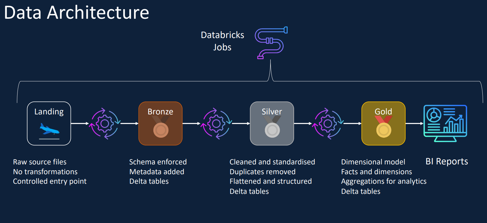
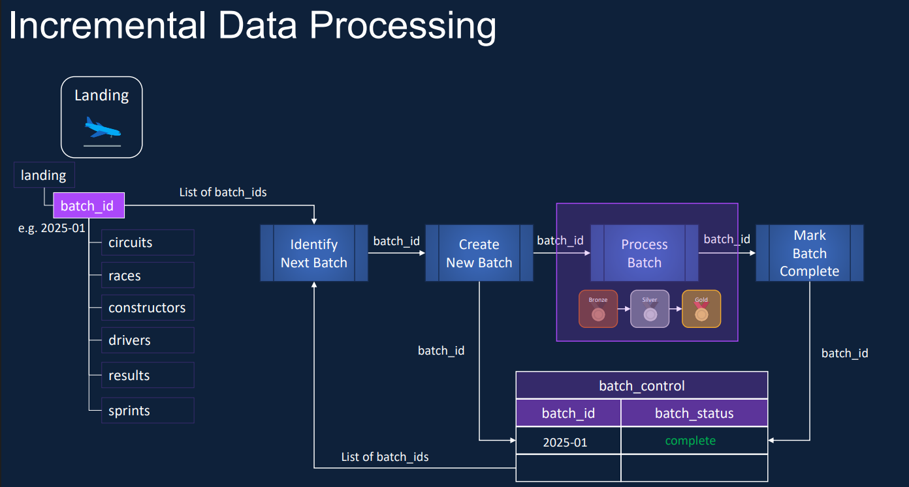
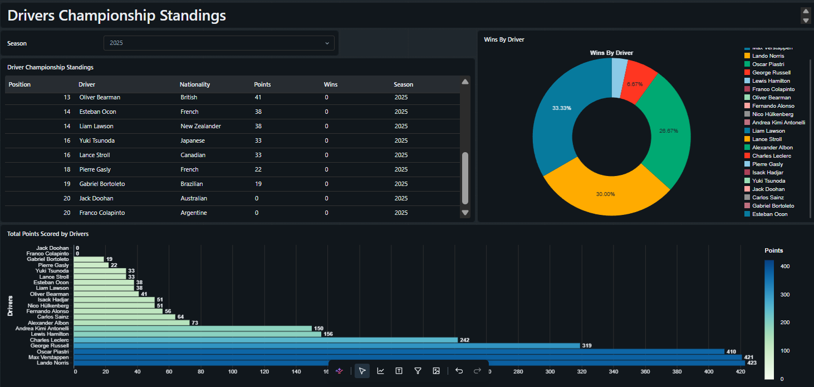
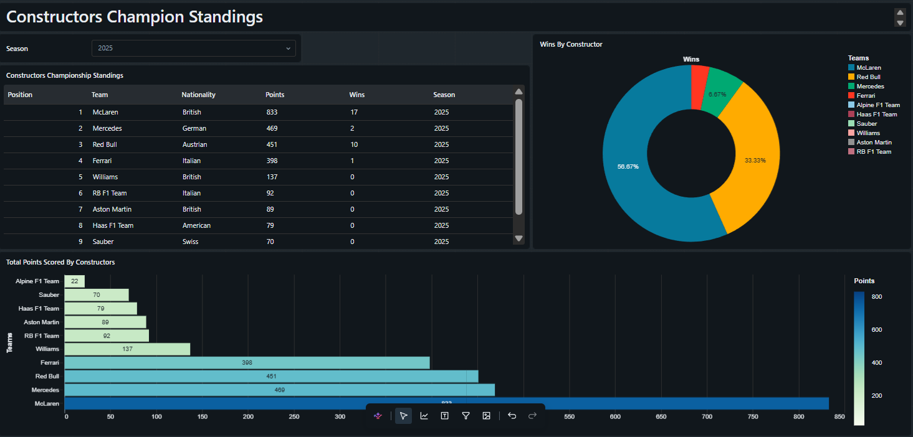
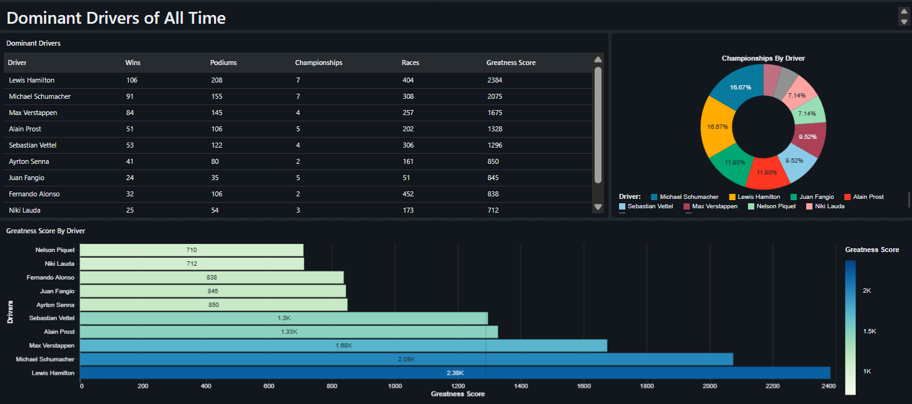
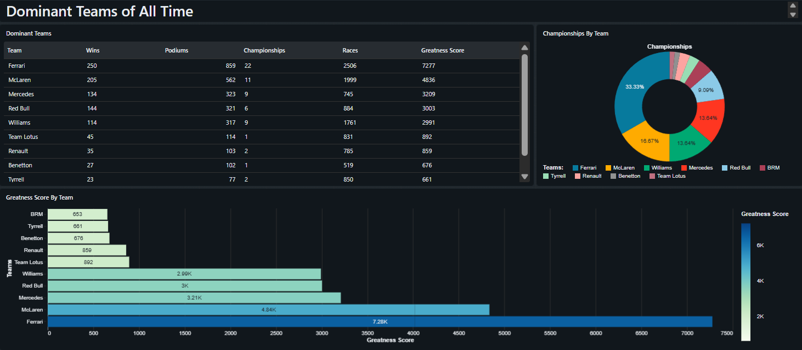

# Azure Databricks Formula 1 Lakehouse Pipeline

An end-to-end data pipeline built on Azure Databricks using the Medallion (Lakehouse) Architecture to ingest, clean, and model Formula 1 racing data, with both a full-refresh version and an incremental-load version demonstrating batch-driven, production-style processing.

## Overview

This project simulates a real-world data engineering workflow: raw Formula 1 data (races, drivers, constructors, results) is ingested, progressively cleaned and modeled through Bronze, Silver, and Gold layers, governed by Unity Catalog, and automated end-to-end with Databricks Lakeflow Jobs.

The repo contains two versions of the pipeline to show the evolution of the design:

| Folder | Description |
|---|---|
| full-refresh-pipeline/ | Processes the complete dataset from scratch on every run |
| incremental-load-pipeline/ | Re-engineered to process data in batches, using a control layer to track and load only new/unprocessed data |

## Architecture



The pipeline follows the Medallion Architecture pattern:

- Landing Zone: Raw CSV/JSON source files land in a designated storage location.
- Bronze Layer: Ingests the raw files into Delta tables, tagging each record with metadata columns (source_file, ingestion_timestamp) for traceability.
- Silver Layer: Cleans the data by handling nulls and duplicates, and standardizing column names and types.
- Gold Layer: Builds a star schema with a fact table (fact_results, including a session_type column distinguishing race vs. sprint sessions, sprints introduced from 2021) and dimension tables for races, drivers, and constructors.
- Orchestration: The full pipeline is automated using a Databricks Lakeflow Job.
- Analytics: A Databricks dashboard is built on top of the Gold layer tables for exploratory analysis.

## Incremental Load Design



The incremental-load-pipeline/ folder extends the base design with batch-driven processing:

- A batch-number parameter drives which slice of data gets processed on each run.
- A dedicated control/orchestration layer (06-orchestration/) tracks progress, fetching the next batch, processing it through Bronze, Silver, and Gold, and marking it complete.
- Orchestrated via Lakeflow Jobs, mirroring how incremental pipelines are typically built in production environments.

## Tech Stack

- Azure Databricks (Serverless Compute)
- Delta Lake
- Unity Catalog (catalogs, schemas, external locations, managed volumes)
- PySpark / Spark SQL
- Databricks Lakeflow Jobs (orchestration)
- Databricks Dashboards (visualization)

## Repository Structure

```
azure-databricks-formula1-lakehouse-pipeline/
├── full-refresh-pipeline/
│   ├── 00-common/          Shared utility notebooks/functions
│   ├── 01-setup/           Unity Catalog setup: external locations, catalogs, schemas, volumes
│   ├── 02-bronze/          Raw ingestion notebooks
│   ├── 03-silver/          Cleaning & standardization notebooks
│   ├── 04-gold/            Star schema build notebooks
│   └── 05-analytics/       Dashboard-ready queries/views
│
└── incremental-load-pipeline/
    ├── 00-common/
    ├── 01-setup/
    ├── 02-bronze/
    ├── 03-silver/
    ├── 04-gold/
    ├── 05-analytics/
    └── 06-orchestration/   Batch control layer: fetch next batch, process, mark complete
```

## Getting Started

Prerequisites:
- An Azure subscription with an Azure Databricks workspace (Unity Catalog enabled)
- A storage credential and external location already configured in your Azure environment

Setup:
1. Clone this repo into your Databricks workspace using a Databricks Git folder.
2. In 01-setup/, replace the placeholder values (<your-cloud-link>, <your-storage-credential>) with your own Azure storage details.
3. Run the 01-setup notebook(s) to create the external location, catalog, schemas, and volumes.
4. Run the pipeline notebooks in order: Bronze, Silver, Gold (or trigger the Lakeflow Job to run them end-to-end).
5. Explore the results via the Gold layer tables or the analytics/dashboard notebooks.

## Data Source

Formula 1 data sourced from the jolpica/jolpica-f1 GitHub repository (https://github.com/jolpica/jolpica-f1).

- Open-source API using the relational-style Ergast format
- Released under the Apache 2.0 license, permitting educational use
- Provided in multiple file formats for learning purposes:

| Dataset | Format |
|---|---|
| Circuits | CSV |
| Races | CSV |
| Constructors | Single-line JSON |
| Drivers | Single-line nested JSON |
| Results | Single-line JSON (multiple files) |
| Sprints | Multi-line JSON (multiple files) |

## Dashboard

A Databricks dashboard built on top of the Gold layer tables, including driver championship standings, a win-distribution breakdown by driver, total points scored per driver, constructor championship standings, and a historical look at the most dominant drivers and teams of all time.

### Driver Standings


### Constructor Standings


### Dominant Drivers of All Time


### Dominant Teams of All Time


## What This Project Demonstrates

- Designing and implementing Medallion (Bronze/Silver/Gold) architecture
- Data governance with Unity Catalog (catalogs, schemas, external locations, volumes)
- Star schema dimensional modeling
- Pipeline orchestration and automation with Lakeflow Jobs
- Incremental/batch processing design patterns
- Building analytics-ready datasets and dashboards

## Author

Harshad
Aspiring Data Engineer, Microsoft Certified Databricks Data Engineer Associate (DP-750)

Feel free to connect or reach out with feedback.
